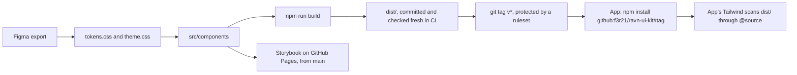

# Design

**The kit follows Figma value for value, except where Figma fails WCAG AA; there AA wins and
the ratio is written at the call site.** The one exception to that exception is the brand's
main button, which still fails, on purpose.

## How the kit reaches an app

A git install runs no build, so the app gets the tagged bytes. The two ways to wire the
styles are in [`README.md`](../README.md), "Wire up styles".

## States

The kit has no screens of its own. It gives each screen the pieces its states need, and each
piece has a story to look at.

| State   | Kit piece                                                         | Story                                                                     |
| ------- | ----------------------------------------------------------------- | ------------------------------------------------------------------------- |
| Loading | `Skeleton`; `TaskTable` with `isLoading`                          | Primitives/Skeleton; TaskTable "Loading"                                  |
| Empty   | `EmptyState`, with an optional action; `TaskTable` with no rows   | Components/EmptyState "WithAction"; TaskTable "Empty"                     |
| Error   | `FormField` messages on an invalid control; `Toast` tone `danger` | Primitives/FormField "WithError", "EveryControlInvalid"; Components/Toast |
| Success | `Toast` tone `success`                                            | Components/Toast                                                          |
| Confirm | `Modal` with `role="alertdialog"`                                 | Modal "AlertDialog"                                                       |

The app's [design page](https://github.com/f3r21/ravn-task-management-challenge/blob/dev/docs/design.md)
has the state table per screen.

## Where the kit differs from Figma

Each row is one of the four calls on the Storybook **Decisions** page
(`src/styles/decisions.mdx`).

| Figma                                       | The kit                                                               | Why                                                                                  |
| ------------------------------------------- | --------------------------------------------------------------------- | ------------------------------------------------------------------------------------ |
| A 1440px canvas, no breakpoints             | Desktop only; `AppShell` stops fitting below 833px and scrolls        | Fixed widths are the design; one responsive piece inside a rigid shell is worse (§1) |
| Tag, badge and small-label colours under AA | The fill stays as drawn; the label changes colour until it clears AA  | "accessibility wins, and the deviation is written down at the call site" (§2)        |
| White on `primary-4` for the main button    | Ships as drawn: 3.83:1 against 4.5:1                                  | No colour in the palette fixes it; a new red would invent a design value (§3)        |
| No field labels anywhere                    | Labels render visually hidden by default; `isLabelVisible` shows them | A screen-reader user would otherwise meet an unnamed input (§4)                      |

`src/styles/contrast.test.ts` recomputes each ratio from the tokens, including the button's
failing 3.83:1, so a changed hex fails the suite.
